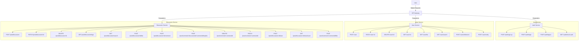

# Spyne Backend

```mermaid
graph TD

    User -->|Makes Requests| API[API Gateway]

    API -->|Forwards to| Auth[Auth Service]
    API -->|Forwards to| UserSvc[User Service]
    API -->|Forwards to| Discussion[Discussion Service]

    subgraph Auth Service
        Auth1[POST /auth/sign-up]
        Auth2[POST /auth/login]
        Auth3[POST /auth/logout]
        Auth4[GET /auth/check-auth]
        Auth --> Auth1
        Auth --> Auth2
        Auth --> Auth3
        Auth --> Auth4
    end

    subgraph User Service
        User1[POST /user]
        User2[PATCH /user/:id]
        User3[DELETE /user/:id]
        User4[GET /user/:id]
        User5[GET /user/list]
        User6[GET /user/search]
        User7[POST /users/follow/:id]
        User8[POST /user/verify]
        UserSvc --> User1
        UserSvc --> User2
        UserSvc --> User3
        UserSvc --> User4
        UserSvc --> User5
        UserSvc --> User6
        UserSvc --> User7
        UserSvc --> User8
    end

    subgraph Discussion Service
        Discussion1[POST /post/discussion]
        Discussion2[PATCH /post/discussion/:id]
        Discussion3[DELETE /post/discussion/:id]
        Discussion4[GET /post/discussion/tags]
        Discussion5[GET /post/discussion/search]
        Discussion6[POST /post/discussion/:id/like]
        Discussion7[POST /post/discussion/:id/comment]
        Discussion8[POST /post/comment/:discussionId/:commentId/replies]
        Discussion9[DELETE /post/comment/:commentId]
        Discussion10[PATCH /post/comment/:commentId]
        Discussion11[POST /post/discussion/:id/view]
        Discussion12[GET /post/discussion/:id/viewCount]
        Discussion13[POST /post/comment/:commentId/like]
        Discussion --> Discussion1
        Discussion --> Discussion2
        Discussion --> Discussion3
        Discussion --> Discussion4
        Discussion --> Discussion5
        Discussion --> Discussion6
        Discussion --> Discussion7
        Discussion --> Discussion8
        Discussion --> Discussion9
        Discussion --> Discussion10
        Discussion --> Discussion11
        Discussion --> Discussion12
        Discussion --> Discussion13
    end

```
