# Spyne Chat Backend

This project is a microservices-based application consisting of the following services:

- **User Service**: Manages user data and operations.
- **Auth Service**: Handles user authentication.
- **Post Service**: Manages discussion posts and related operations.
- **API Gateway**: Acts as a single entry point to the system.

## Table of Contents

1. [Installation and Setup](#installation-and-setup)
2. [Low Level Design Document](#low-level-design-document)
   - [Detailed Description of each Component](#detailed-description-of-each-component)
   - [System Architecture Diagram](#system-architecture-diagram)
3. [Database Schema](#database-schema)
   - [Table/Collection Definitions and Relationships](#tablecollection-definitions-and-relationships)
4. [API Documentation](#api-documentation)
   - [Endpoint Definitions and Request/Response Formats](#endpoint-definitions-and-requestresponse-formats)

## Installation and Setup

### Prerequisites

- Docker
- Docker Compose

### Steps to Run the Project

1. **Clone the repository**

   ```bash
   git clone https://github.com/qur786/spyne-chat-backend.git
   cd spyne-chat-backend
   ```

2. **Set up environment variables**
   Create a `.env` file for each service (`user/.env`, `auth/.env`, `post/.env`) with the necessary environment variables.

3. **Build and run the services using Docker Compose**

   ```bash
   docker-compose up --build
   ```

4. **Access the services**
   - API Gateway: `http://localhost:3000`
   - User Service: `http://localhost:3001` or `http://localhost:3000/user`
   - Auth Service: `http://localhost:3002` or `http://localhost:3000/auth`
   - Post Service: `http://localhost:3003` or `http://localhost:3000/post`

## Low Level Design Document

### Detailed Description of each Component

1. **API Gateway**

   - Routes requests to the appropriate microservices.

2. **Auth Service**

   - Manages user authentication (signup, login, logout).
   - Issues and validates JSON Web Tokens (JWTs).

3. **User Service**

   - Manages user data including creation, updating, deletion, and searching of users.
   - Handles user-specific operations such as following other users.

4. **Post Service**
   - Manages discussion posts and related operations such as liking, commenting, and viewing posts.
   - Handles post-specific operations such as updating and deleting posts and comments.

### System Architecture Diagram

```mermaid
graph TD

    User -->|Makes Requests| API[API Gateway]

    API -->|Forwards to| Auth[Auth Service]
    API -->|Forwards to| UserSvc[User Service]
    API -->|Forwards to| Discussion[Discussion Service]

    subgraph Auth Service
        Auth1[POST /auth/sign-up]
        Auth2[POST /auth/login]
        Auth3[POST /auth/logout]
        Auth4[GET /auth/check-auth]
        Auth --> Auth1
        Auth --> Auth2
        Auth --> Auth3
        Auth --> Auth4
    end

    subgraph User Service
        User1[POST /user]
        User2[PATCH /user/:id]
        User3[DELETE /user/:id]
        User4[GET /user/:id]
        User5[GET /user/list]
        User6[GET /user/search]
        User7[POST /user/follow/:id]
        User8[POST /user/verify]
        UserSvc --> User1
        UserSvc --> User2
        UserSvc --> User3
        UserSvc --> User4
        UserSvc --> User5
        UserSvc --> User6
        UserSvc --> User7
        UserSvc --> User8
    end

    subgraph Discussion Service
        Discussion1[POST /post/discussion]
        Discussion2[PATCH /post/discussion/:id]
        Discussion3[DELETE /post/discussion/:id]
        Discussion4[GET /post/discussion/tags]
        Discussion5[GET /post/discussion/search]
        Discussion6[POST /post/discussion/:id/like]
        Discussion7[POST /post/discussion/:id/comment]
        Discussion8[POST /post/comment/:discussionId/:commentId/replies]
        Discussion9[DELETE /post/comment/:commentId]
        Discussion10[PATCH /post/comment/:commentId]
        Discussion11[POST /post/discussion/:id/view]
        Discussion12[GET /post/discussion/:id/viewCount]
        Discussion13[POST /post/comment/:commentId/like]
        Discussion --> Discussion1
        Discussion --> Discussion2
        Discussion --> Discussion3
        Discussion --> Discussion4
        Discussion --> Discussion5
        Discussion --> Discussion6
        Discussion --> Discussion7
        Discussion --> Discussion8
        Discussion --> Discussion9
        Discussion --> Discussion10
        Discussion --> Discussion11
        Discussion --> Discussion12
        Discussion --> Discussion13
    end

    Discussion -->|Validates with| Auth
    Discussion -->|Gets User Info from| UserSvc
    UserSvc -->|Validates with| Auth
```



## Database Schema

### Table/Collection Definitions and Relationships

1. **User Collection**

   - `_id`: ObjectId
   - `name`: String
   - `mobile`: String
   - `email`: String
   - `password`: String
   - `followers`: Array of ObjectId (References User)
   - `createdAt`: Date
   - `updatedAt`: Date

2. **Discussion Collection**

   - `_id`: ObjectId
   - `title`: String
   - `text`: String
   - `imageUrl`: String
   - `tags`: Array of Strings
   - `createdBy`: ObjectId (References User)
   - `likes`: Array of ObjectId (References User)
   - `viewCount`: Number
   - `comments`: Array of ObjectId (References Comment)
   - `createdAt`: Date
   - `updatedAt`: Date

3. **Comment Collection**

   - `_id`: ObjectId
   - `text`: String
   - `createdBy`: ObjectId (References User)
   - `likes`: Array of ObjectId (References User)
   - `replies`: Array of ObjectId (References Comment)
   - `discussion`: ObjectId (References Discussion)
   - `createdAt`: Date
   - `updatedAt`: Date

4. **Token Collection**

   - `_id`: ObjectId
   - `token`: String
   - `createdAt`: Date
   - `updatedAt`: Date

## API Documentation

### Endpoint Definitions and Request/Response Formats

#### Auth Service

- **POST /auth/sign-up**

  - Request: `{ "name": "user", "mobile": "1234567890", "email": "user@example.com", "password": "password", "followers": [] }`
  - Response: `{ "_id": "user-id", "name": "user", "mobile": "1234567890", "email": "user@example.com", "password": "hashed-password", "followers": [], createdAt: "2022-02-26T16:37:48.244Z", updatedAt: "2022-02-26T16:37:48.244Z" }`

- **POST /auth/login**

  - Request: `{ "email": "user@example.com", "password": "password" }`
  - Response: `{ "user": { "_id": "user-id", "name": "user", "mobile": "1234567890", "email": "user@example.com", "password": "hashed-password", "followers": [], createdAt: "2022-02-26T16:37:48.244Z", updatedAt: "2022-02-26T16:37:48.244Z" }, "token": "jwt-token" }`

- **POST /auth/logout**

  - Request: `{}`
  - Response: `{ "message": "Logged out successfully" }`

- **GET /auth/check-auth**
  - Request: `{}`
  - Response: `{ "_id": "user-id", "name": "user", "mobile": "1234567890", "email": "user@example.com", "password": "hashed-password", "followers": [], createdAt: "2022-02-26T16:37:48.244Z", updatedAt: "2022-02-26T16:37:48.244Z" }`

#### User Service

- **POST /user**

  - Request: `{ "name": "user", "mobile": "1234567890", "email": "user@example.com", "password": "password", "followers": [] }`
  - Response: `{ "user": { "_id": "user-id", "name": "user", "mobile": "1234567890", "email": "user@example.com", "password": "hashed-password", "followers": [], createdAt: "2022-02-26T16:37:48.244Z", updatedAt: "2022-02-26T16:37:48.244Z" } }`

- **PATCH /user/:id**

  - Request: `{ "username": "newuser" }`
  - Response: `{ "user": { "_id": "user-id", "name": "newuser", "mobile": "1234567890", "email": "user@example.com", "password": "hashed-password", "followers": [], createdAt: "2022-02-26T16:37:48.244Z", updatedAt: "2022-02-26T16:37:48.244Z" } }`

- **DELETE /user/:id**

  - Request: `{}`
  - Response: `{ "_id": "user-id", "name": "user", "mobile": "1234567890", "email": "user@example.com", "password": "hashed-password", "followers": [], createdAt: "2022-02-26T16:37:48.244Z", updatedAt: "2022-02-26T16:37:48.244Z" }`

- **GET /user/:id**

  - Request: `{}`
  - Response: `{ "_id": "user-id", "name": "user", "mobile": "1234567890", "email": "user@example.com", "password": "hashed-password", "followers": [], createdAt: "2022-02-26T16:37:48.244Z", updatedAt: "2022-02-26T16:37:48.244Z" }s`

- **GET /user/list**

  - Request: `{}`
  - Response: `[{ "_id": "user-id", "name": "user", "mobile": "1234567890", "email": "user@example.com", "password": "hashed-password", "followers": [], createdAt: "2022-02-26T16:37:48.244Z", updatedAt: "2022-02-26T16:37:48.244Z" }]`

- **GET /user/search**

  - Request: `{ "query": "username" }`
  - Response: `{ "_id": "user-id", "name": "user", "mobile": "1234567890", "email": "user@example.com", "password": "hashed-password", "followers": [], createdAt: "2022-02-26T16:37:48.244Z", updatedAt: "2022-02-26T16:37:48.244Z" }`

- **POST /users/follow/:id**

  - Request: `{}`
  - Response: `{ "_id": "user-id", "name": "user", "mobile": "1234567890", "email": "user@example.com", "password": "hashed-password", "followers": ["new-user"], createdAt: "2022-02-26T16:37:48.244Z", updatedAt: "2022-02-26T16:37:48.244Z" }`

- **POST /user/verify**
  - Request: `{ "email": "user@example.com", "token": "verification-token" }`
  - Response: `{ "user": { "_id": "user-id", "name": "user", "mobile": "1234567890", "email": "user@example.com", "password": "hashed-password", "followers": [], createdAt: "2022-02-26T16:37:48.244Z", updatedAt: "2022-02-26T16:37:48.244Z" } }`

#### Discussion Service

- **POST /post/discussion**

  - Request: `{ "title": "Discussion title", "text": "Discussion content", "tags": ["tag1", "tag2"], "imageUrl: "#" }`
  - Response: `{ "_id": "discussion-id", "title": "Discussion title", "text": "Discussion content", imageUrl: "#", "tags": ["tag1", "tag2"], "createdBy": "user-id", likes: [], viewCount: 0, comments: [], createdAt: "2022-02-26T16:37:48.244Z", updatedAt: "2022-02-26T16:37:48.244Z"  }`

- **PATCH /post/discussion/:id**

  - Request: `{ "title": "New title" }`
  - Response: `{ "_id": "discussion-id", "title": "New title", "text": "Discussion content", imageUrl: "#", "tags": ["tag1", "tag2"], "createdBy": "user-id", likes: [], viewCount: 0, comments: [], createdAt: "2022-02-26T16:37:48.244Z", updatedAt: "2022-02-26T16:37:48.244Z"  }`

- **DELETE /post/discussion/:id**

  - Request: `{}`
  - Response: `{ "_id": "discussion-id", "title": "Discussion title", "text": "Discussion content", imageUrl: "#", "tags": ["tag1", "tag2"], "createdBy": "user-id", likes: [], viewCount: 0, comments: [], createdAt: "2022-02-26T16:37:48.244Z", updatedAt: "2022-02-26T16:37:48.244Z"  }`

- **GET /post/discussion/tags**

  - Request: `{ "query": { "tags": ["tag1", "tag2"] } }`
  - Response: `{ "_id": "discussion-id", "title": "Discussion title", "text": "Discussion content", imageUrl: "#", "tags": ["tag1", "tag2"], "createdBy": "user-id", likes: [], viewCount: 0, comments: [], createdAt: "2022-02-26T16:37:48.244Z", updatedAt: "2022-02-26T16:37:48.244Z"  }`

- **GET /post/discussion/search**

  - Request: `{ "query": { "search": "search text"} }`
  - Response: `{ "_id": "discussion-id", "title": "Discussion title", "text": "Discussion content", imageUrl: "#", "tags": ["tag1", "tag2"], "createdBy": "user-id", likes: [], viewCount: 0, comments: [], createdAt: "2022-02-26T16:37:48.244Z", updatedAt: "2022-02-26T16:37:48.244Z"  }`

- **POST /post/discussion/:id/like**

  - Request: `{}`
  - Response: `{ "_id": "discussion-id", "title": "Discussion title", "text": "Discussion content", imageUrl: "#", "tags": ["tag1", "tag2"], "createdBy": "user-id", likes: ["user-id"], viewCount: 0, comments: [], createdAt: "2022-02-26T16:37:48.244Z", updatedAt: "2022-02-26T16:37:48.244Z"  }`

- **POST /post/discussion/:id/comment**

  - Request: `{ "text": "Comment content" }`
  - Response: `{ "_id": "discussion-id", "title": "Discussion title", "text": "Discussion content", imageUrl: "#", "tags": ["tag1", "tag2"], "createdBy": "user-id", likes: [], viewCount: 0, comments: [comment-id], createdAt: "2022-02-26T16:37:48.244Z", updatedAt: "2022-02-26T16:37:48.244Z"  }`

- **POST /post/comment/:discussionId/:commentId/replies**

  - Request: `{ "text": "Reply content" }`
  - Response: `{ "_id": "comment-id", "text": "Reply content", "createdBy": "user-id", "likes": [], "replies": ["user-id"], "discussion": "discussion-id", createdAt: "2022-02-26T16:37:48.244Z", updatedAt: "2022-02-26T16:37:48.244Z" }`

- **DELETE /post/comment/:commentId**

  - Request: `{}`
  - Response: `{ "_id": "comment-id", "text": "Comment", "createdBy": "user-id", "likes": [], "replies": [], "discussion": "discussion-id", createdAt: "2022-02-26T16:37:48.244Z", updatedAt: "2022-02-26T16:37:48.244Z" }`

- **PATCH /post/comment/:commentId**

  - Request: `{ "text": "Updated comment content" }`
  - Response: `{ "_id": "comment-id", "text": "Updated comment content", "createdBy": "user-id", "likes": [], "replies": [], "discussion": "discussion-id", createdAt: "2022-02-26T16:37:48.244Z", updatedAt: "2022-02-26T16:37:48.244Z" }`

- **POST /post/discussion/:id/view**

  - Request: `{}`
  - Response: `{ "_id": "discussion-id", "title": "Discussion title", "text": "Discussion content", imageUrl: "#", "tags": ["tag1", "tag2"], "createdBy": "user-id", likes: ["user-id"], viewCount: 1, comments: [], createdAt: "2022-02-26T16:37:48.244Z", updatedAt: "2022-02-26T16:37:48.244Z"  }`

- **GET /post/discussion/:id/viewCount**

  - Request: `{}`
  - Response: `{ "viewCount": 1 }`

- **POST /post/comment/:commentId/like**
  - Request: `{}`
  - Response: `{ "_id": "comment-id", "text": "Comment", "createdBy": "user-id", "likes": ["user-id"], "replies": [], "discussion": "discussion-id", createdAt: "2022-02-26T16:37:48.244Z", updatedAt: "2022-02-26T16:37:48.244Z" }`

## Conclusion

This project demonstrates a microservices architecture with separate services for user management, authentication, and discussion handling. The API Gateway serves as the single entry point for all client requests, routing them to the appropriate microservices. The provided documentation covers installation, setup, design, database schema, and API endpoint definitions.
